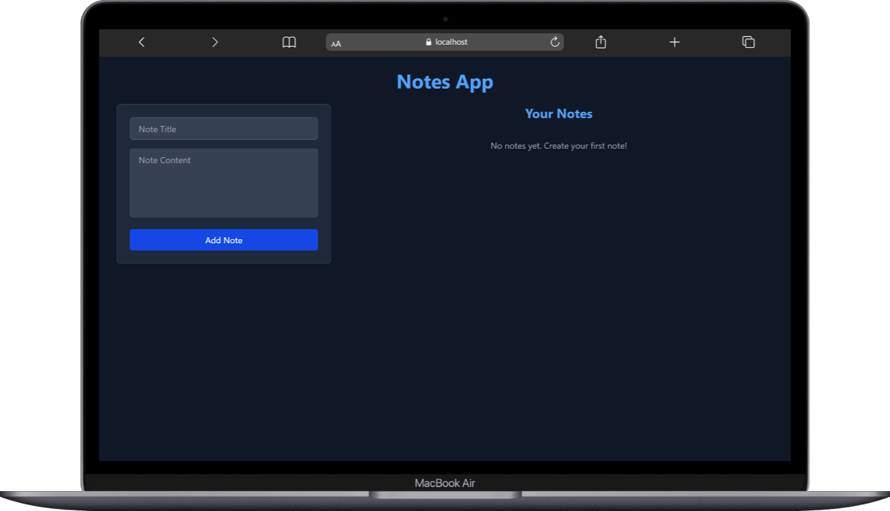
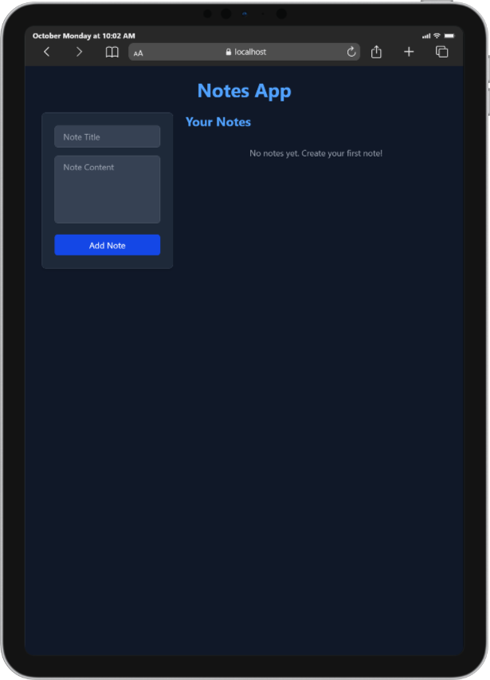
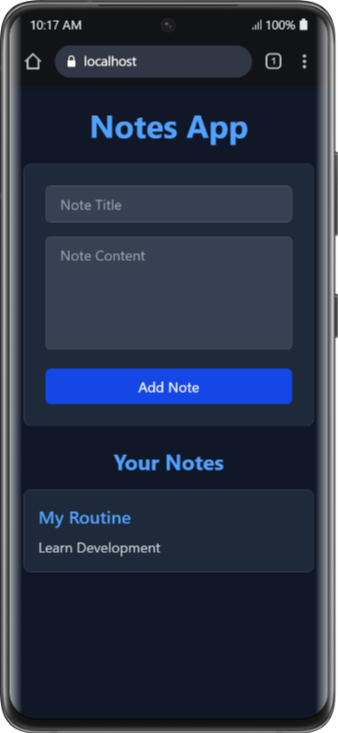

# Notes App 📝

A modern, responsive notes application built with React and styled with Tailwind CSS. This application allows users to create, store, and manage their notes with a beautiful dark-themed interface.

## 🌟 Features

- **Responsive Design**: Works seamlessly across all devices
- **Dark Theme**: Easy on the eyes with a modern purple accent
- **Real-time Updates**: Notes appear instantly when added
- **Clean UI**: Intuitive interface for the best user experience

## 📱 Responsive Design

### Desktop View


_Full desktop experience with side-by-side layout_

### Tablet View


_Optimized view for tablet devices_

### Mobile View


_Compact and functional mobile experience_

## 🚀 Technologies Used

- **React**: Frontend library for building user interfaces
- **Tailwind CSS**: Utility-first CSS framework for styling
- **Vite**: Next-generation frontend tooling

## 🛠️ Installation

1. Clone the repository:

```bash
git clone https://github.com/haseebjaved4212/Notes-App.git
```

2. Navigate to the project directory:

```bash
cd Notes-App
```

3. Install dependencies:

```bash
npm install
```

4. Start the development server:

```bash
npm run dev
```

## 🎨 Features Details

### Note Creation

- Add a title for your note
- Write detailed content in the textarea
- One-click submission with the "Add Note" button

### Responsive Design

- **Desktop**: Side-by-side layout for efficient use of space
- **Tablet**: Adaptive layout that maintains functionality
- **Mobile**: Stacked layout for easy mobile access

### Dark Theme

- Sophisticated dark color palette
- Purple accent colors for visual hierarchy
- Comfortable reading experience
- Hover effects and smooth transitions

## 🤝 Contributing

Contributions, issues, and feature requests are welcome! Feel free to check [issues page](https://github.com/haseebjaved4212/Notes-App/issues).

## 📝 License

This project is open source and available for anyone to use, modify, and distribute.

## 👨‍💻 Author

**Haseeb Javed**

- GitHub: [@haseebjaved4212](https://github.com/haseebjaved4212)

## 🙏 Acknowledgments


- Inspired by the need for a clean, modern note-taking application
